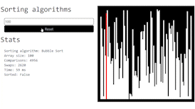

# Sorting Algorithms Visualizer
> This project is a web application that visualizes sorting algorithms

## Introduction

Welcome to the Sorting Algorithms Visualizer project! This project is supposed to help you with visualizing sorting algorithms. Test introduction

## Used languages

This project uses the following languages:

- HTML
- General Information
- JavaScript

## Usage

this project can be used as follows:
Just open the index.html file in your browser or visit the website at https://sorting-algorithms-visualizations.netlify.app/

## License

This project is licensed under the MIT license

## Contributing

Contributing is welcomed in this Project. To contribute please follow these instructions of the owner:
1. Please fork the Repository
2. Commit your changes
3. Please open a pull request with your changes, and I will review them.

## Disclaimer

This is a fun project to learn Javascript.
